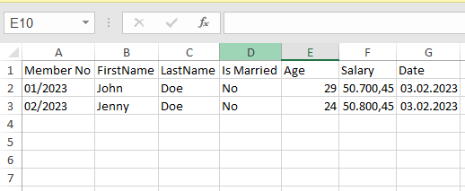

# dotnet-core-excel-helper

## Summary
This helper convert a type of class list to excel table.

## Usage

``` c# 
// ViewModel
public class UserViewModel
{
    public int Id { get; set; } // This property will be ignored.

    [ExcelColumnName("Member No")]
    public string MemberNo { get; set; }

    [ExcelColumnName("FirstName")]
    public string FirstName { get; set; }

    [ExcelColumnName("LastName")]
    public string LastName { get; set; }

    [ExcelColumnName("Is Married")]
    public bool IsMarried { get; set; }

    [ExcelColumnName("Age")]
    public int Age { get; set; }

    [ExcelColumnName("Salary")]
    public decimal Salary { get; set; }

    [ExcelColumnName("Date")]
    public DateTime Date { get; set; }
}

// HomeController
public IActionResult CreateExcelFile()
{
    //modelList
    List<UserViewModel> list = new()
    {
        new UserViewModel{
            Id = 1,
            FirstName = "John",
            LastName = "Doe",
            Age = 29,
            IsMarriage = false,
            Salary = 50700.45M,
            MemberNo = "01/2023",
            Date = DateTime.Now
        },
        new UserViewModel
        {
            Id = 1,
            FirstName = "Jenny",
            LastName = "Doe",
            Age = 24,
            IsMarriage = true,
            Salary = 50800.45M,
            MemberNo = "02/2023",
            Date = DateTime.Now
        },
    };

    var byteArr = ExcelHelper<UserViewModel>.CreateExcelFile(list);
    return File(byteArr, "application/vnd.openxmlformats-officedocument.spreadsheetml.sheet", "users-file.xlsx");
}
```

## Result


